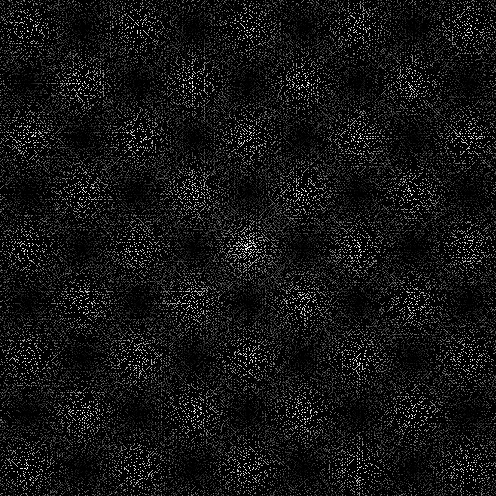
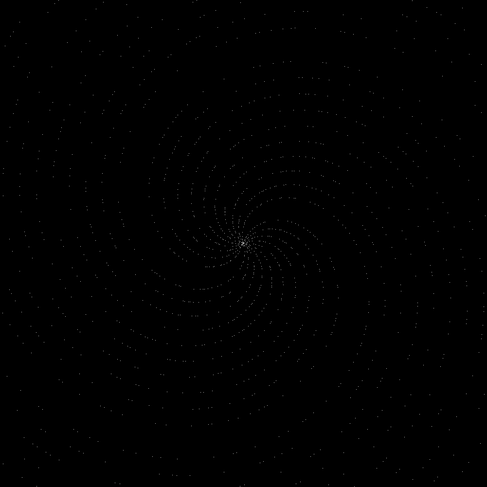
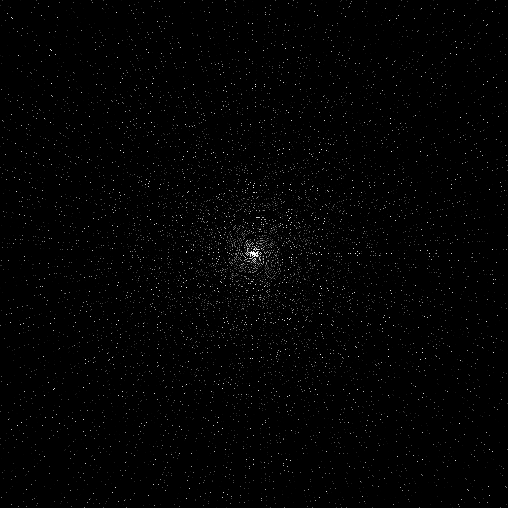

# Ulam Spiral

The Ulam Spiral is a mathematical visualization of the distribution of prime numbers. It is named after Stanislaw Ulam, a Polish mathematician who discovered it in 1963.

## Description

The Ulam Spiral consists of a square grid of numbers arranged in a spiral pattern, starting from the center and moving outwards. In the center of the spiral is the number 1, and the numbers increase in a clockwise direction. The spiral is usually drawn with a width and height of a prime number, such as 29 x 29 or 41 x 41.

To create the Ulam Spiral, we mark the prime numbers in the grid as white dots, while the composite numbers are left black. By doing so, we can visually observe certain patterns in the distribution of primes, such as diagonal lines or clusters.

The Ulam Spiral has many interesting properties and is widely used in number theory and mathematical research. It is also a popular subject for programming projects and can be implemented using a variety of programming languages and techniques.


Here's an example of an Ulam Spiral with a size of 7 x 7:
```
37 36 35 34 33 32 31
38 17 16 15 14 13 30
39 18  5  4  3 12 29
40 19  6  1  2 11 28
41 20  7  8  9 10 27
42 21 22 23 24 25 26
43 44 45 46 47 48 49

         |
         |
         V

37                31
   17          13   
       5     3    29
   19        2 11   
41     7            
         23         
43          47      

```

## How to
```bash
$ cargo build --release
```

```bash
Generate Ulam Spiral

Usage: ulam-spiral [OPTIONS] --format <FORMAT> --output <OUTPUT>

Options:
  -f, --format <FORMAT>  Type of Ulam Spiral to draw (Square or Circle) [possible values: square, circle]
  -l, --last <LAST>      Last value for the Ulam Spiral [default: 1001]
  -o, --output <OUTPUT>  Output file
  -w, --width <WIDTH>    Image width [default: 1001]
  -s, --scale <SCALE>    Zoom out scale multiplier [default: 1]
  -d, --dot <DOT>        Dot size for prime numbers [default: 1]
  -v, --verbose          Verbosity
  -h, --help             Print help
  -V, --version          Print version
```

## Examples
```bash
$ ./target/debug/ulam-spiral -l 1001 -f square -o example-square.png
```


```bash
$ ./target/debug/ulam-spiral -l 20001 -f circle -o example-circle-s20.png -s 20
```


```bash
$ ./target/debug/ulam-spiral -l 20001 -f circle -o example-circle-s200.png -s 200
```

